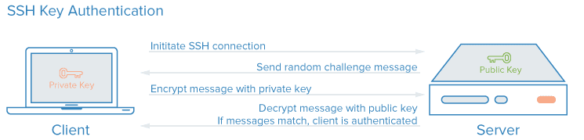

# SSH

## 흐름



- 클라이언트가 서버에 SSH 연결을 요청한다.
- 서버는 랜덤 챌린지(랜덤 데이터 스트링)를 생성해 클라이언트에게 보낸다.
- 클라이언트는 서버로 부터 받은 챌린지(C)를 자신이 가지고 있는 private 키로 암호화해서 암호화 된 메시지를 서버로 보낸다.
- 서버는 클라이언트에서 받은 암호화 된 메시지를 public 키로 해석한 후 그 결과를 2단계에서 자신이 \* \* 클라이언트에게 보낸 랜덤 챌린지와 일치하는지 확인한다.
- 일치하면 클라이언트가 인증된 것이다.

## 작업

- 클라이언트에서 비밀키와 공개키를 생성한다. [ssh-keygen](#ssh-keygen)
- 클라이언트에서 서버로 공개키를 복사한다. [ssh-copy-id](#ssh-copy-id)
  - 이 단계를 완료하면 암호 없이 접속이 가능하다.
- 클라이언트에서 타겟서버로 ssh접속 [ssh](#ssh)

## 주요 명령어

1. **ssh:** SSH로 원격 서버에 접속하는 명령어입니다. 공개 키를 원격 서버에 복사한 경우 비밀번호를 입력하지 않고 접속할 수 있습니다.

2. ### scp

3. ### sftp

4. **ssh-agent:** SSH 에이전트는 개인 키를 메모리에 로드하고 인증 요청을 처리하는 도구입니다. SSH 클라이언트에서 에이전트를 실행하고 개인 키를 관리합니다.

PassPhrase를 입력하여 키를 생성하였다면, 키를 사용할 때마다 PassPhrase를 입력해야 한다.

SSH 에이전트는 개인키를 메모리에 로드하고 있다가 클라이언트의 요청이 있으면 에이전트가 SSH 클라이언트를 대신해서 인증을 처리해준다. 만약에 키 생성 시 비밀번호를 입력하지 않았다면 사용할 필요가 없다.

SSH 클라이언트는 환경 변수를 통해 에이전트를 찾는다. 에이전트를 실행하고 환경 변수를 등록하는 방법은 두가지가 있다.

      ```shell
      $ ssh-agent
      SSH_AUTH_SOCK=/tmp/ssh-XXXXXXEphqgf/agent.6260; export SSH_AUTH_SOCK;
      SSH_AGENT_PID=6261; export SSH_AGENT_PID;
      echo Agent pid 6261;
      ```

- 별도의 독립 쉘로 실행(single shell)
  ```shell
  $ eval `ssh-agent`
  ```
  별도의 쉘에서 실행되기 때문에 로그아웃을 해도 에이전트가 종료되지 않는다. 로그아웃시 종료되어야하는 상황에서는 추천하지 않는다.
- 현재 실행중인 쉘의 하부 쉘로 실행(sub shell)
  ```shell
  $ ssh-agent $SHELL
  ```
  또는 다음처럼 쉘을 지정할 수 있다.
  ```shell
  $ ssh-agent bash
  ```

5. **ssh-add:** SSH 에이전트에 개인 키를 등록하고 관리합니다. 등록된 키는 SSH 클라이언트에서 사용됩니다.

    | 옵션 | 설명                                                |
    | ---- | --------------------------------------------------- |
    | -l   | 등록된 개인키의 핑거프린트(fingerprint)를 출력한다. |
    | -L   | 등록된 개인키의 키 전체 내용을 출력한다.            |
    | -d   | 에이전트로부터 키를 제거한다.                       |
    | -D   | 에이전트가 가진 모든 키를 제거한다.                 |
    | -t   | 유효기간을 설정, 기본단위는 초, m,h,d,w 지정 가능   |

    먼저 ssh-agent 에게 관리할 개인 키를 알려줘야 합니다. ssh-add 명령을 등록할 개인 키의 경로를 주고 실행하면 됩니다.

    그후에 pass phrase 를 입력해 주면 추가되었다는 메시지가 나오고 login session 이 유지되는 동안 해당 개인 키의 pass phrase 는 다시 입력하지 않아도 됩니다.

    ```shell
    $ ssh-add -t 4w ~/.ssh/id_rsa
    ```

6. **ssh-keygen**:SSH 키 쌍을 생성하는 명령어입니다. 키 쌍에는 개인 키 (private key)와 공개 키 (public key)가 포함됩니다. 공개 키는 원격 서버로 복사되어 인증에 사용되고, 개인 키는 클라이언트에 저장되어 안전하게 보관됩니다.


    | 옵션 | 설명                                       |
    | ---- | ------------------------------------------ |
    | -t   | 어떠한 암호화 방식을 사용 할 것인지를 지정 |
    | -b   | 생성할 키 비트수 지정                      |
    | -f   | 저장할 파일을 지정. 기본값은 ~/.ssh/id_rsa |
    | -C   | Comment                                    |

    ```shell
    $ ssh-keygen -t rsa -b 4096 -C "tykim@gaia3d.com"
    ```

7. **ssh-keyscan:** 원격 서버의 호스트 키를 스캔하여 클라이언트의 `known_hosts` 파일에 추가합니다. 이렇게 하면 호스트의 신뢰성을 확인할 수 있습니다.


    | 옵션 | 설명                                          |
    | ---- | --------------------------------------------- |
    | - t  | 암호화하는 타입이다.                          |
    | - b  | 암호의 bit수를 의미하며 default값은 2048이다. |
    | - C  | 주석 부분으로 역할이 특별히 없다.             |

    ```shell
    $ ssh-keyscan -t rsa <remote-server> >> ~/.ssh/known_hosts
    ```

8.  **ssh-copy-id:** 공개 키를 원격 서버에 복사하여 비밀번호 없이 SSH로 접속할 수 있도록 설정합니다.

    원격서버로 접속하려면 보통 암호를 입력하여 인증을 받아야한다.

    원격서버로 공개키를 서버로 복사하여, 암호를 입력하지 않아도 접속할 수 있다.

    서버의 ~/.ssh/authorized_keys 파일에 공개키가 추가된다.

    ```shell
    $ ssh-copy-id <<remote-server>>
    ```
